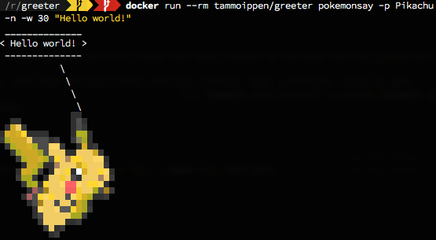
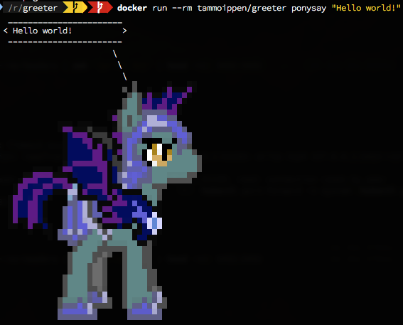

# Terminal Greeter

One docker image to rule them all:

- [fortune](https://github.com/ahills/fortune): for important information on the future
- [cowsay](https://github.com/schacon/cowsay/): for cows telling the future
- [pokemonsay](https://github.com/possatti/pokemonsay): for pokemons telling the future
- [ponysay](https://github.com/erkin/ponysay/): for ponies telling the future

Inspired by the following docker images:

- [mpepping/ponysay](https://github.com/mpepping/docker-ponysay)
- [xaviervia/pokemonsay](https://github.com/xaviervia/docker-pokemonsay)

Based on [python:3.7-alpine3.9](https://hub.docker.com/_/python/) to keep it small.

All these commands can be executed as expected:

(*`fortune` is the default command*)

```sh
» docker run --rm tammoippen/greeter
Know what I hate most?  Rhetorical questions.
		-- Henry N. Camp
```

```
» docker run --rm tammoippen/greeter cowsay "Hello world!"
 ______________
< Hello world! >
 --------------
        \   ^__^
         \  (oo)\_______
            (__)\       )\/\
                ||----w |
                ||     ||
```

```sh
» docker run --rm tammoippen/greeter pokemonsay -n -w 30 "Hello world!"
```



```sh
» docker run --rm tammoippen/greeter ponysay "Hello world!"
```



## Let them tell fortunes

Pipe the fortune to the speaker - do not forget the `-i`.

```
» docker run --rm tammoippen/greeter | docker run --rm -i tammoippen/greeter cowsay
 _____________________________________
/ As long as the answer is right, who \
\ cares if the question is wrong?     /
 -------------------------------------
        \   ^__^
         \  (oo)\_______
            (__)\       )\/\
                ||----w |
                ||     ||
```

## Random sayer

Randomly select the speaker:

```
» docker run --rm tammoippen/greeter | docker run --rm -i tammoippen/greeter say                                                          (2s 63ms)
 ________________________________________
/ Committees have become so important    \
| nowadays that subcommittees have to be |
\ appointed to do the work.              /
 ----------------------------------------
   \
    \
        .--.
       |o_o |
       |:_/ |
      //   \ \
     (|     | )
    /'\_   _/`\
    \___)=(___/
```
